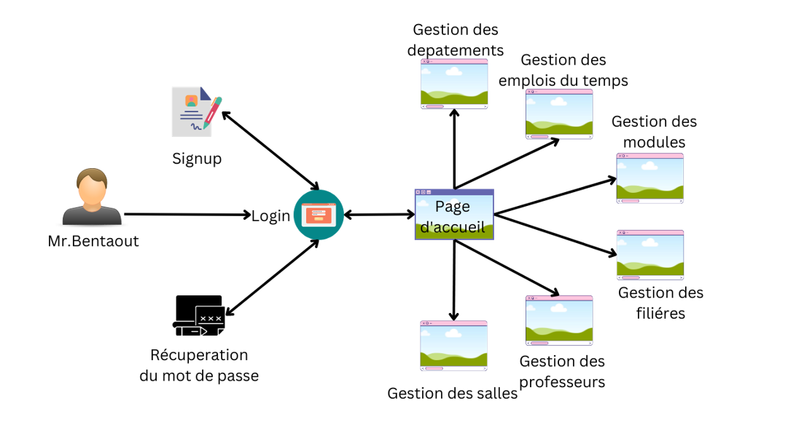
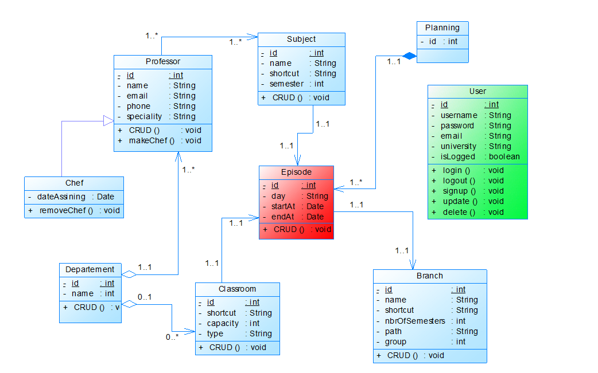
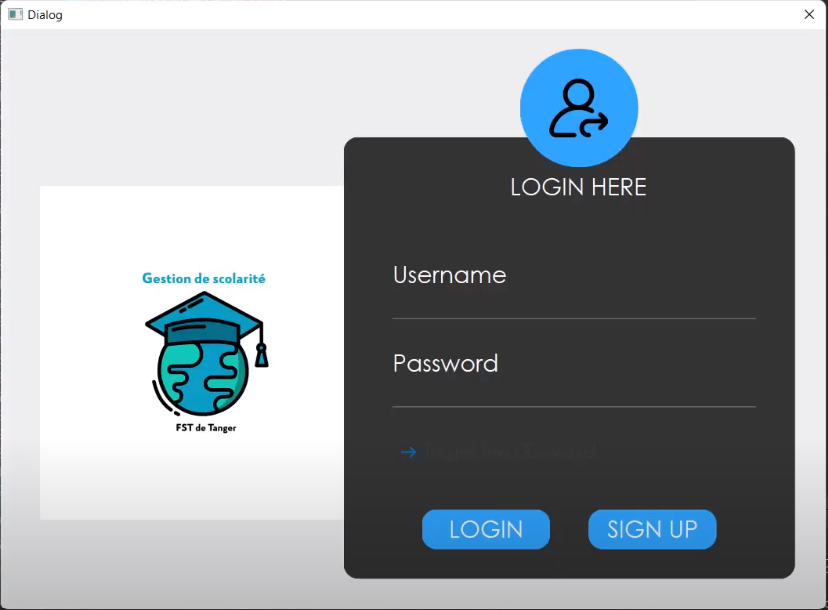
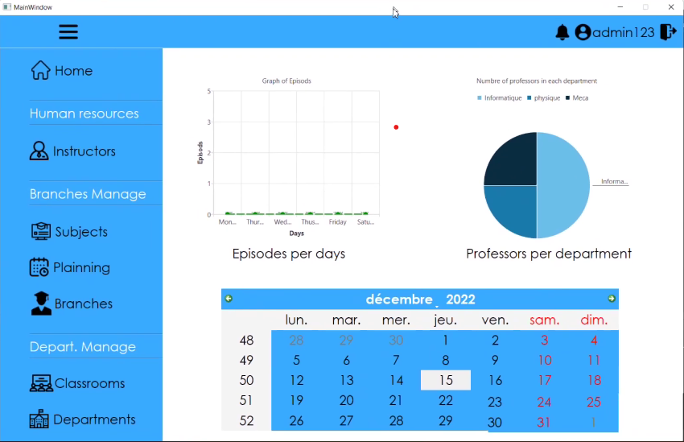
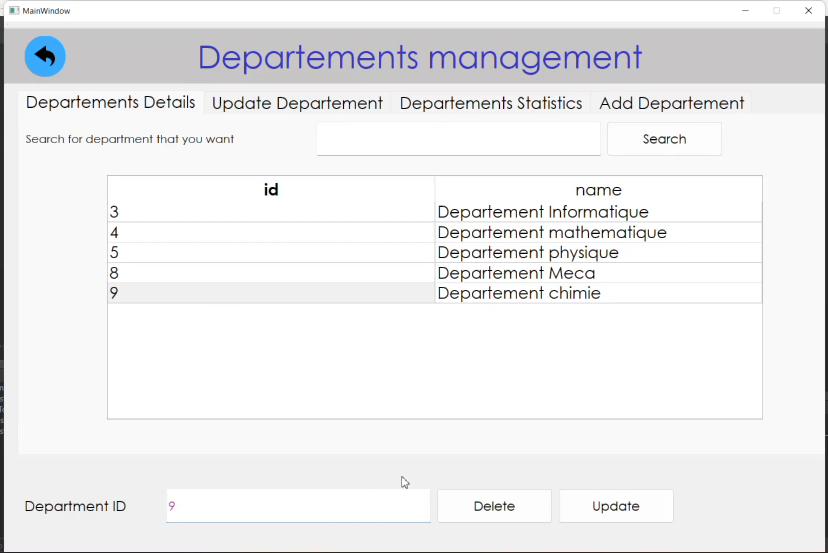
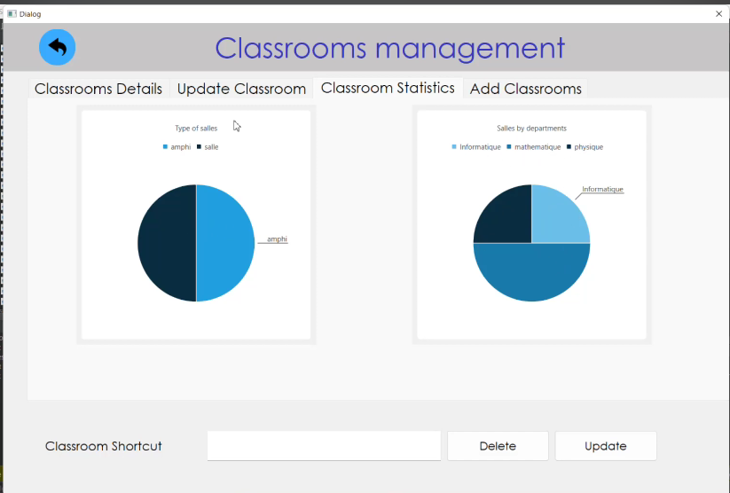
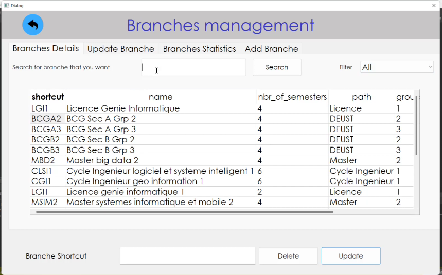
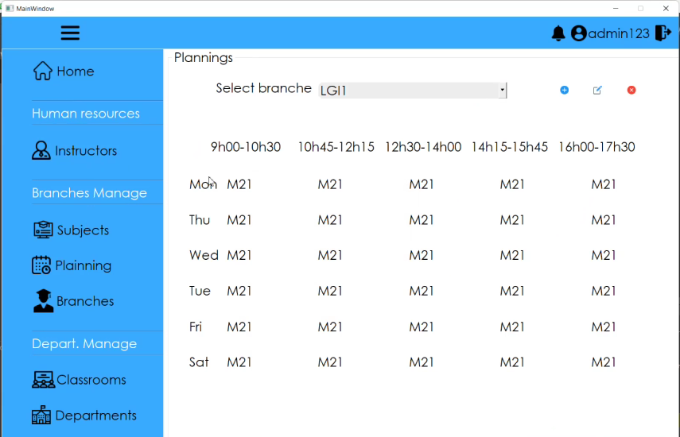

# School Management System

The School Management System is a desktop application developed using Qt and C++. It aims to streamline various administrative tasks related to managing timetables, room reservations, and overall system management at FST Tangier.

## Problem Statement
Traditionally, the creation of timetables for each department and teacher has been a manual process, leading to inefficiencies and time-consuming tasks. Additionally, managing room reservations for professors and departments further complicates the process. Furthermore, there are challenges associated with managing multiple systems within the faculty, including departments, professors, students, and program assignments.

## Solution
The School Management System provides a solution to the aforementioned problems by offering a comprehensive desktop application. The application enables the creation of timetables for each department and teacher in an automated manner, reducing the time and effort required. It also simplifies the reservation process for classrooms, catering to the needs of professors and departments.

## Features
- Automated generation of timetables for each department and teacher.
- Room reservation functionality for professors and departments.
- Efficient management of departments, professors, students, and program assignments.
- User-friendly interface for easy navigation and interaction.
- Customizable settings to adapt to the specific requirements of FST Tangier.

## Architecture
<div align="center">
  
</div>

## Installation
Please follow these steps to install and run the School Management System:

1. Clone the repository:
```bash
git clone https://github.com/boudenjal-mohcine/GST-SCOLARITE.git
```
2. Build the project using Qt Creator or compile it using the appropriate compiler.

3. Run the executable file generated after the build process.

## Usage
1. Launch the School Management System application.

2. Log in using your administrator credentials.

3. Explore the various modules and functionalities available in the application.

4. Create timetables for each department and teacher by inputting the necessary details and preferences.

5. Reserve rooms by selecting the desired dates, times, and specific requirements.

6. Manage departments, professors, students, and program assignments through the respective modules.

7. Customize the application settings as per the specific requirements of FST Tangier and all parts of University Abdelmalek Essaadi.

## Class Diagram
<div align="center">
  
</div>

## Screenshots
<div align="center">
  
  
</div>
<div align="center">
  
  
</div>
<div align="center">
  
  
</div>

## Contributed by
This project was jointly developed by [Me](https://github.com/your-username) and [Anas Zenagui](https://github.com/ZenaguiAnas). You can find Anas Zenagui on GitHub at [@ZenaguiAnas](https://github.com/ZenaguiAnas).

## Oriented by
This project was oriented by Professor En-naimi.

## License
This project is licensed under the [MIT License](LICENSE).
